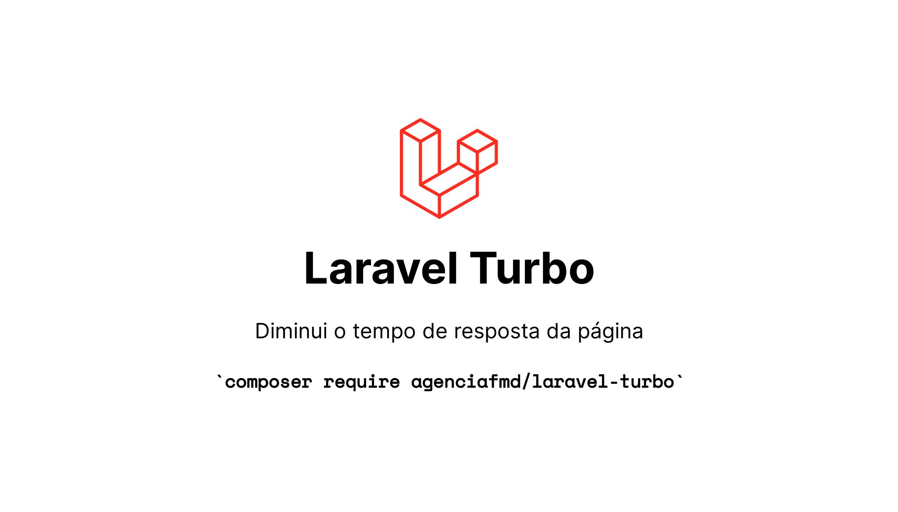

# Laravel – Turbo



[](https://packagist.org/packages/agenciafmd/laravel-turbo)
[](LICENSE.md)

Diminui o tempo de resposta e carregamento das páginas: minifica o HTML e grava uma versão estática de cada rota em `public/page-cache`, para ser servida direto pelo servidor web.

Baseado em:

- https://github.com/vinkius-labs/laravel-page-speed
- https://github.com/JosephSilber/page-cache

## Requisitos

- Laravel ^12.0 | ^13.0
- vinkius-labs/laravel-page-speed ^4.0
- silber/page-cache ^1.1

## Instalação

```bash
composer require agenciafmd/laravel-turbo:dev-master
```

O service provider é registrado automaticamente (package discovery) e cria o grupo de middlewares `turbo`.

## Configuração

### Desabilitando

No `.env`:

```dotenv
TURBO_ENABLED=false
```

Com o Turbo desabilitado, o grupo `turbo` continua existindo, mas vazio — as rotas não precisam ser alteradas.

### Customizando as middlewares de otimização

Publique o arquivo de configuração (`config/laravel-turbo.php`):

```bash
php artisan vendor:publish --tag="laravel-turbo:config"
```

Modifique as middlewares conforme a necessidade ([ver mais](https://github.com/vinkius-labs/laravel-page-speed)). O padrão é:

```php
use Agenciafmd\Turbo\Middlewares\CollapseWhitespace;
use Agenciafmd\Turbo\Middlewares\RemoveComments;
use Silber\PageCache\Middleware\CacheResponse;
use VinkiusLabs\LaravelPageSpeed\Middleware\ElideAttributes;
use VinkiusLabs\LaravelPageSpeed\Middleware\InsertDNSPrefetch;
use VinkiusLabs\LaravelPageSpeed\Middleware\RemoveQuotes;

return [
    'enabled' => env('TURBO_ENABLED', true),
    'middlewares' => [
        CacheResponse::class,
        RemoveComments::class,
        RemoveQuotes::class,
        /* não mude a ordem */
        ElideAttributes::class,
        InsertDNSPrefetch::class,
        CollapseWhitespace::class,
    ],
];
```

`RemoveComments` e `CollapseWhitespace` são versões do pacote que removem os comentários HTML mas **mantêm os comentários dentro de `<style>`**.

## Uso

Adicione a middleware `turbo` na rota. A resposta será minificada e um arquivo estático relativo a ela será criado em `public/page-cache`.

> Se a página exibir dados do banco, limpe o cache assim que esses dados forem atualizados.
> [Ver mais](https://github.com/JosephSilber/page-cache)

```php
Route::get('/', function () {
    return view('welcome');
})->middleware('turbo');
```

Outro exemplo:

```php
Route::get('/', [FrontendController::class, 'index'])
    ->name('frontend.index')
    ->middleware('turbo');
```

Apenas requisições `GET` com status `200` são gravadas (HTML ou JSON).

## Cache

Para limpar o cache estático, use o comando do `silber/page-cache`:

```bash
# tudo
php artisan page-cache:clear

# uma página ou diretório específico
php artisan page-cache:clear blog/meu-artigo
php artisan page-cache:clear blog --recursive
```

## Servidor

Sem a reescrita de URL, o arquivo estático é gerado mas nunca é consumido. Configure o nginx / apache para procurar o arquivo em `public/page-cache` antes de chamar o `index.php`.
[Ver mais](https://github.com/JosephSilber/page-cache#url-rewriting)

A home é gravada como `pc__index__pc.html`. Exemplo para nginx:

```nginx
location = / {
    try_files /page-cache/pc__index__pc.html /index.php?$query_string;
}

location / {
    try_files $uri $uri/ /page-cache/$uri.html /page-cache/$uri.json /index.php?$query_string;
}
```

## Testes

Os testes ficam em `tests/` e usam o `Tests\TestCase` da aplicação, então são executados de dentro do projeto que instala o pacote:

```bash
vendor/bin/pest packages/agenciafmd/laravel-turbo/tests
```

## Licença

Este pacote é software livre e está disponível nos termos da licença MIT.
